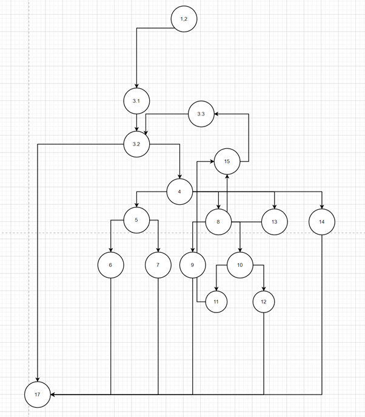
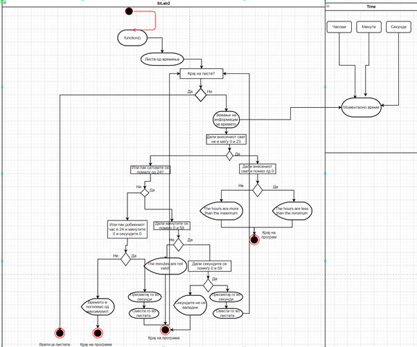

## **Втора лабораториска вежба по Софтверско инженерство**

**1.**

**2.**

3.

Цикломатската комплексност е 8

Добиено со формулата edges-verticies+2

4.Тестови според **Multiple-condition** метода за тестирање.

If(hr\&lt;0 || hr\&gt;24)

| Комбинација | Пример |
| --- | --- |
| ТX | (-1,0,0) |
| FT | (25,0,0) |
| FF | (23,0,0) |

If(min \&lt; 0 || min\&gt;59)

| Комбинација | Пример |
| --- | --- |
| TX | (22,-4,0) |
| FT | (21,69,0) |
| FF | (13,44,0) |

If (sec \&gt;=0 &amp;&amp; \&lt;=59)

| Комбинација | Пример |
| --- | --- |
| TT | (22,25,23) |
| TF | (22,23,69) |
| FX | (22,22,-1) |

If(Hr==24 &amp;&amp; min ==0 &amp;&amp; sec==0)

| Комбинација | Пример |
| --- | --- |
| FXX | (23,0,0) |
| TFX | (24,1,123) |
| TTF | (24,1,2) |
| TTT | (24,0,0) |

5.Тестови според **Every-Branch** метода.

A= HR\&lt;24,!(sec\&gt;=0&amp;\&lt;60)

B= HR\&lt;24,sec\&gt;=0&amp;\&lt;60

C=kraj na lista

| (23,0,69) | (23,0,45) | (23,-1,0) | (25,0,0) | (-1,0,0) | (24,0,0) | Гранка |
| --- | --- | --- | --- | --- | --- | --- |
| * | * | * | * | * | * | 1,2-3 |
| * | * | * | * | * | * | 3.2-17 |
| | * | | | | * | 15-3.3 |
| | * | | | | * | 3.3-3.2 |
| * | * | * | * | * | * | 3.1-3.2 |
| | | | | | | 3.2-17 |
|* |* |* |* |* |* | 3.2-4 |
| | | |* |* | | 4-5 |
| | | | |* | | 5-6 |
| | | |* | | | 5-7 |
|*|* |* | | | | 4-8 |
| | |*| | | | 8-9 |
|*|* | | | | | 8-10 |
| | * | | | | | 10-11 | 
| | * | | | | | 11-15 |
| * | | | | | | 10-12 |
| |  | | | | * | 4-13 |
| | | | | | * | 13-15 |
| | | | | | * | 4-14 |